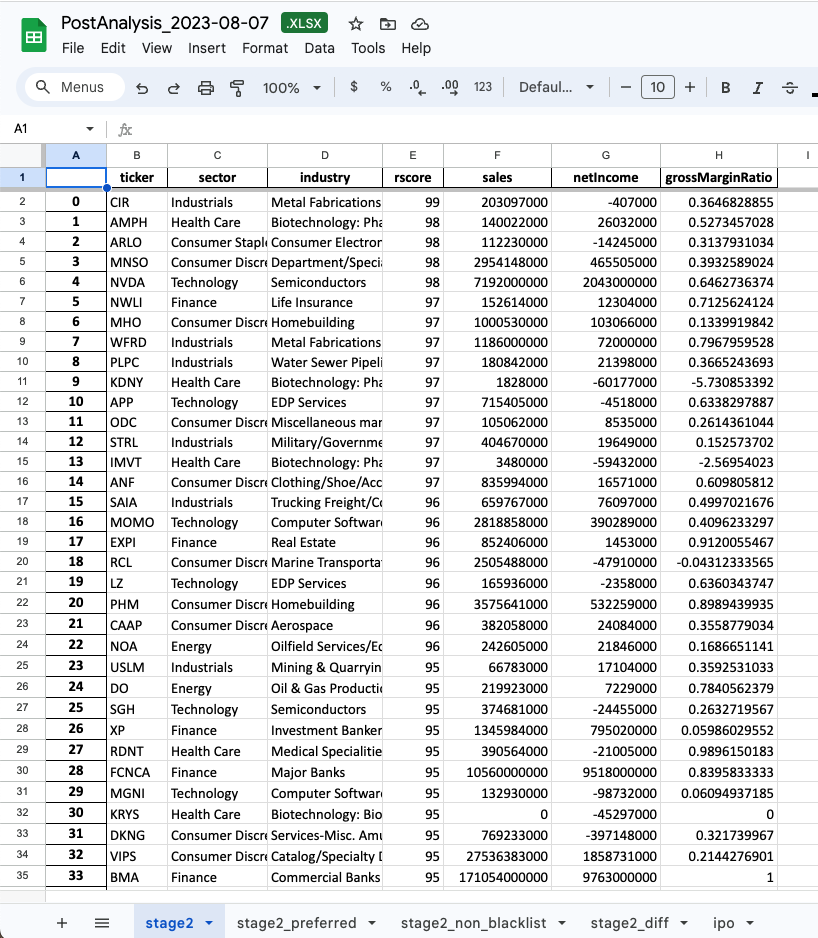

# US Stock Wizard

> Built by the trader, for traders.

This is a simple but powerfultool to help you find the best stock to buy in US stock market, a great alternative to [Stock Rover](https://www.stockrover.com/).

It include the following features:

- [x] Find all the symbols in the US stock market (NYSE, NASDAQ)
- [x] Automatically download fundamental data for all the stocks in the US stock market via Alpha Vantage API.
- [x] Automatically download daily candlestick chart for all the stocks in the US stock market.
- [x] Automacatlly calcuate the Relative Strength for all stocks, and calcuate the NAA200R for all stocks in NASDAQ.
- [x] Filter all stocks meeting your criteria.
- [x] Automatically generate a report in Google Drive for you.
- [x] Fully integrated with TradingView(R), let you import over 1,000+ symbols into your watchlist with one click.
- [x] Automatically notify you when app starts, and when the report is generated.
- [x] Fully Customizable, you can add your own filters, and add your own indicators.

We use the following tools to build this project:

- Prisma
- PostgreSQL
- Google Drive API
- Pandas

## Prerequisites

- Apply for the Alpha Vantage API key here: [https://www.alphavantage.co/support/#api-key](https://www.alphavantage.co/support/#api-key). We strongly recommend you to apply for the paid plan, to accelerate the data download process.

- Apply for the Google Drive API here: [https://developers.google.com/drive/api/v3/quickstart/python](https://developers.google.com/drive/api/v3/quickstart/python). Save the credentials.json to the `./src/googleauth.json` directory of this project. See `./src/googleauth.example.json` for more details. Then, create a Google Drive Folder, extract the `Google Drive Folder ID`, which is the URI of the folder, and add it to the `GDRIVE_PARENT_FOLDER_ID` in `.env` file. You can follow [this video](https://www.youtube.com/watch?v=tamT_iGoZDQ) for more instruction.

- If you want to be notifed when the report is generated, you can apply for a DingTalk robot, and add the key and secret to the `.env` file.

## Config

Below is an example of `.env` under the root directory of this project:

```env
ALPHA_VANTAGE_API_KEYS=key1,key2,key3
GDRIVE_PARENT_FOLDER_ID=your_google_parent_folder_id
DINGTALK_KEY=your_dingtalk_key
DINGTALK_SECRET=your_dingtalk_secret
API_HOST=https://your-domain.com/
```

## Installation

- Add the root path to `PYTHONPATH` in your `.bashrc` or `.zshrc` file:

- Install the dependencies by `pip3 install -r requirements.txt`

- Assuming your project is located at `/path/to/us_stock_wizard`, and your timezone is UTC-4, you can add the following cron job to your server:

```bash
# Update fundamental data every day at 9:30
30 09 * * * python3 /path/to/us_stock_wizard/updater/get_fundamentals.py
# Update dividend data every day at 9:30 to accelerete the candlestick chart generation
30 07 * * * python3 /path/to/us_stock_wizard/updater/get_dividends.py
# After market close, update candlestick chart every day and generate a report for you.
05 16 * * * python3 /path/to/us_stock_wizard/updater/all_in_one.py
```

Setting up a FastAPI Server

## Flow Chart

To help better understand how it works, here is a flowchart.


## How to use it

Once you have installed the project, it will generate a daily report for you automatically. Find the report in your Google Drive folder.


Below is an example of the report:


